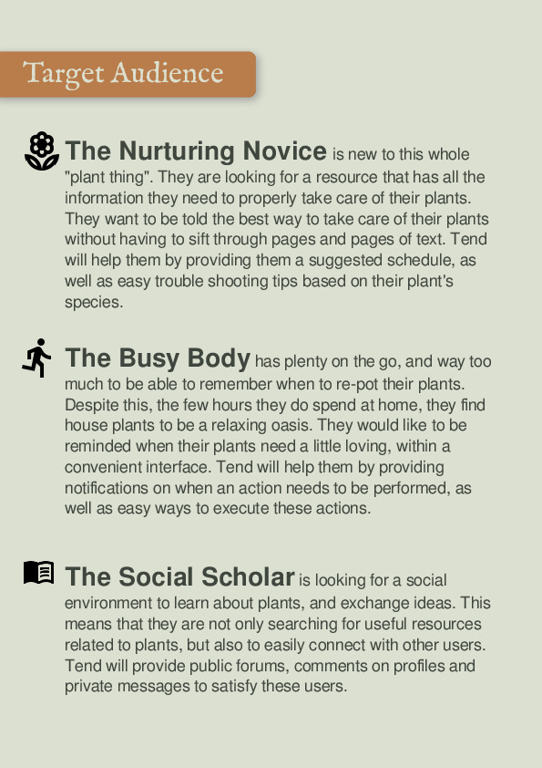
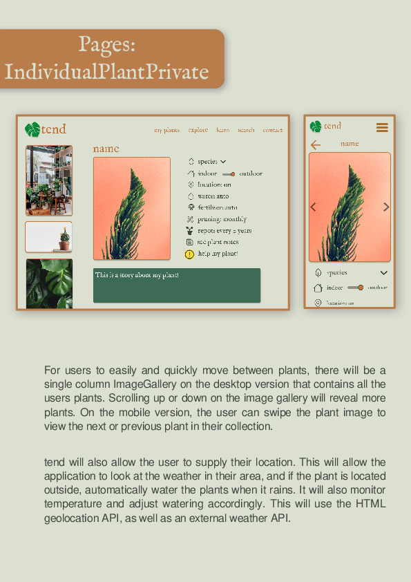

# tend

## Brief Overview
tend is a responsive web application for horticulture enthusiasts, or “Plant Parents”. tend helps
people who have house plants to keep track of the watering, fertilizing and re-potting schedule needed
for their many plants. This can get especially difficult if there are more than just a few plants. tend
will also act as a social website for these plant enthusiasts to share their plants, as well as discuss
different species and techniques.

## Setup
To get started run **npm install**, then run **npm run serve** for the development server.

Alternatively run **npm run build** to create a production version in the dist/ folder.

A live demo is hosted on *tend.brandonmurch.com*

## Formal Proposal

